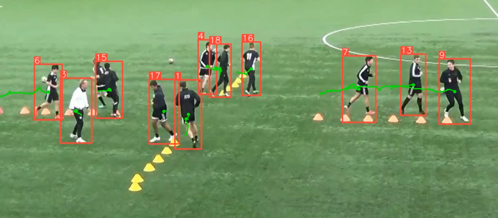

# Object Tracking
The general process is to detect obstacles using an object detection algorithm, match these bounding box with former bounding boxes we have using The Hungarian Algorithm; and then predict future bounding box positions or actual positions using Kalman Filters. From that, we could use Machine Learning to predict future behavior or trajectories, we could be able to estimate what an obstacle has been doing the last 10 seconds. This tool is powerful and tracking become not only possible, but also very accurate. Velocities can be estimated and a huge set of possibilites becomes available.

- Clone the repository
```bash
  git clone https://github.com/sohag-mbstu-ict/Object-Tracking-with-DeepSORT_YOLOv8-and-ByteTrack.git
```
- Goto the cloned folder.

```bash
  cd <folder name>
```
- Create environment.

```bash
  python -m venv env 
```
- Activate the environment

```bash
  env\scripts\activate
```
- Install the dependecies

```bash
  pip install -r requirements.txt
```


## Tracking with DeepSORT and yolov8 pretrained model


## Tracking with yolov8 tracker (BOTSORT, ByteTracker)




## Counting cars with yolov8 (ByteTracker, supervision)


 SORT works in 2 stages, and DeepSORT adds a 3rd stage. First stage is detection, which is handled by YOLOv8, next is track association, which is handled by Kalman Filter and IOU. DeepSORT implements the 3rd stage, a Siamese network to compare the appearance features between current detections and the features of each track
